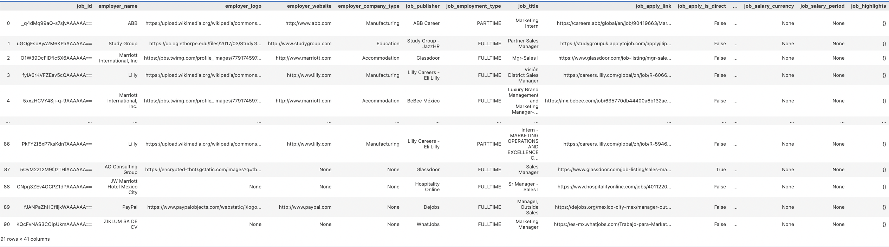

# JSearch

Use rapidapi JSearch API:

https://rapidapi.com/letscrape-6bRBa3QguO5/api/jsearch

Following the Python snippet:

```
import http.client

conn = http.client.HTTPSConnection("jsearch.p.rapidapi.com")

headers = {
    'X-RapidAPI-Key': "use-your-api-key",
    'X-RapidAPI-Host': "jsearch.p.rapidapi.com"
}

conn.request("GET", "/search?query=Some%20occupation%20in%20Mexico&page=4&num_pages=20", headers=headers)

res = conn.getresponse()
data = res.read()

print(data.decode("utf-8"))
```

That creates a JSON like variable in `data` with the following structure:

```
{
    "status": "OK",
    "request_id": "1fd6f328-9ca3-49ee-b823-2c69228f069a",
    "parameters": {
        "query": "some occupation in mexico",
        "page": 1,
        "num_pages": 1
    },
    "data": [
        {
         ... some job post details ...
        }
    ]
```

Then convert it to a Panda's Dataframe:

```
import pandas as pd
import json

# Parse the JSON string into a Python dictionary
data_dict = json.loads(data.decode("utf-8"))

# Convert the 'data' section of the dictionary into a DataFrame
df = pd.DataFrame(data_dict['data'])
```



We can also save the dataframe as a CSV file:

```
# Save the DataFrame to a CSV file
df.to_csv('some_occupation_job_posts.csv', index=False)
```

**Note:**
After some test it seems that JSearch is returning repeated results.
For an example try the following:

Search for: "Marketing manager in Mexico", the query would be something like: 

```
conn.request("GET", "/search?query=Marketing%20manager%20in%20Mexico&page=1&num_pages=1", headers=headers)
```

If we play with the `page` and the `num_pages` we seem to get different ammount of results. We tried the following series:

**num_pages** fixed in 20 and **page** changing from 1 to 4 incrementally.

And got 4 CSV's that added for around 370 job posts. But after cleaning it and removing dupicates we ended with 114 (see folder marketing_manager for the files).

Could we run more tests with more occupations? For example, I got 0 results when looking for *ICT Sales Professional* 

